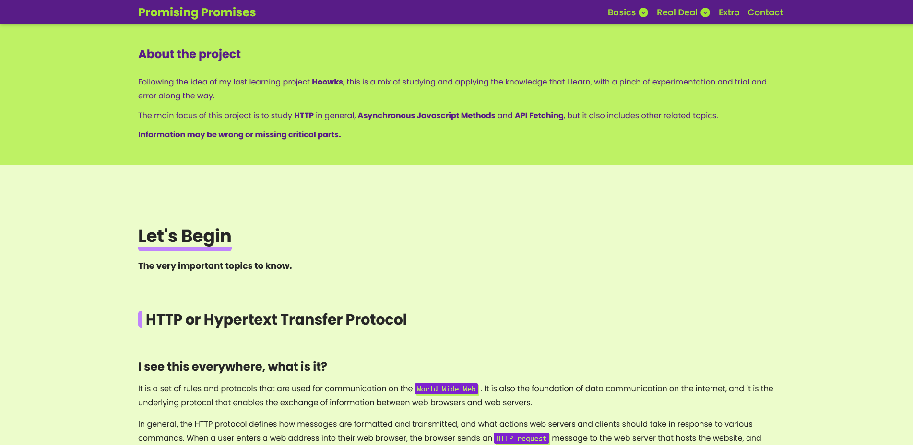

### The Project

Following the idea of my last learning project Hoowks, this is a mix of studying and applying the knowledge that I learn, with a pinch of experimentation and trial and error along the way, and also playing around and having some fun.

The main focus of this project is to study HTTP, Asynchronous Javascript Methods and API Fetching.

## Screenshot

## Live Site
[PromisingPromises](https://promisingpromises.netlify.app/)

## Techs Used

- React
- Vite
- Tailwind